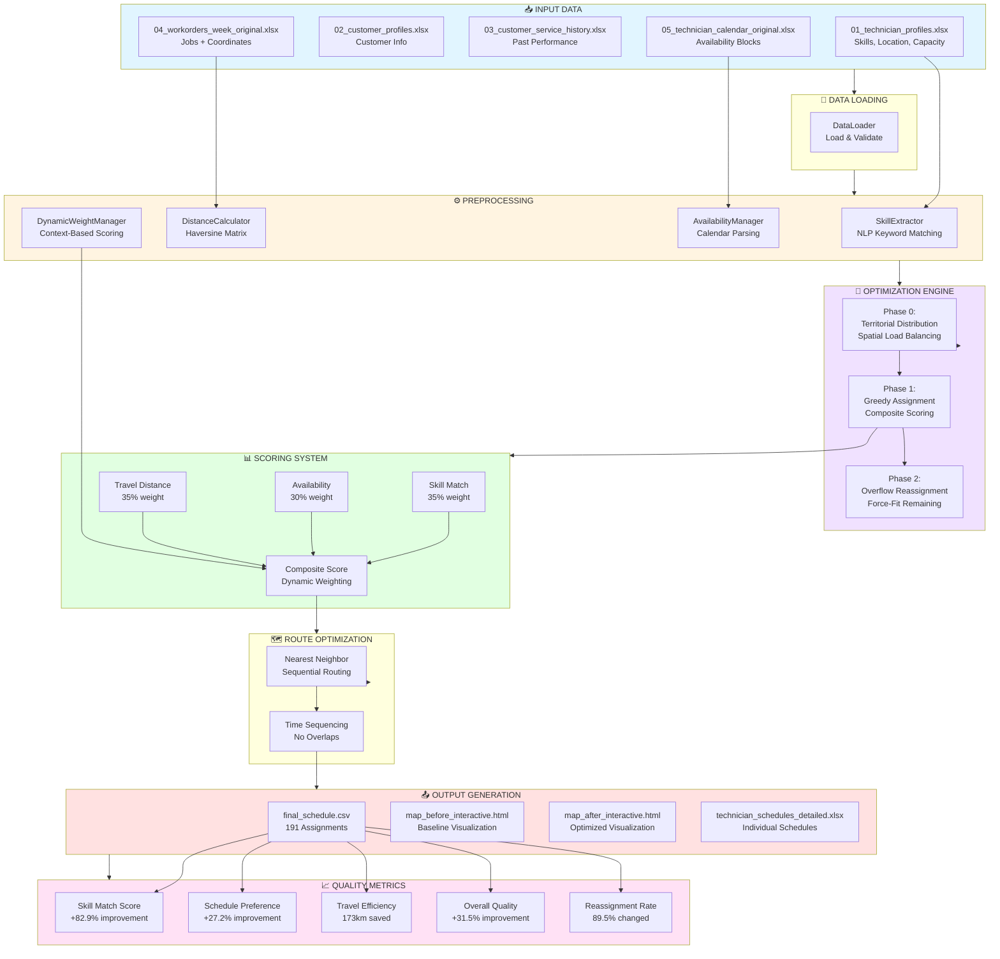
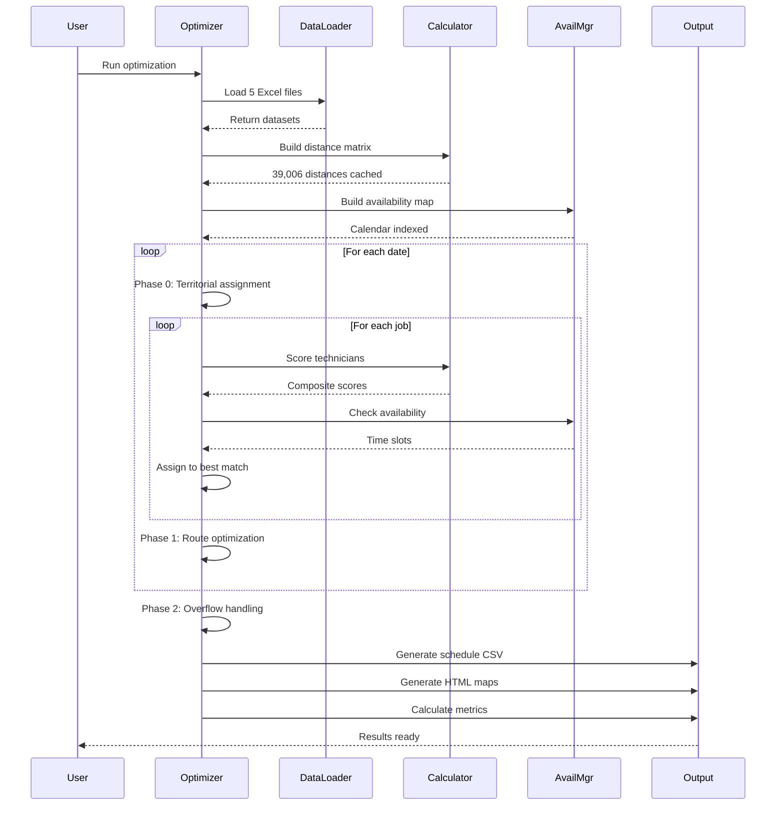
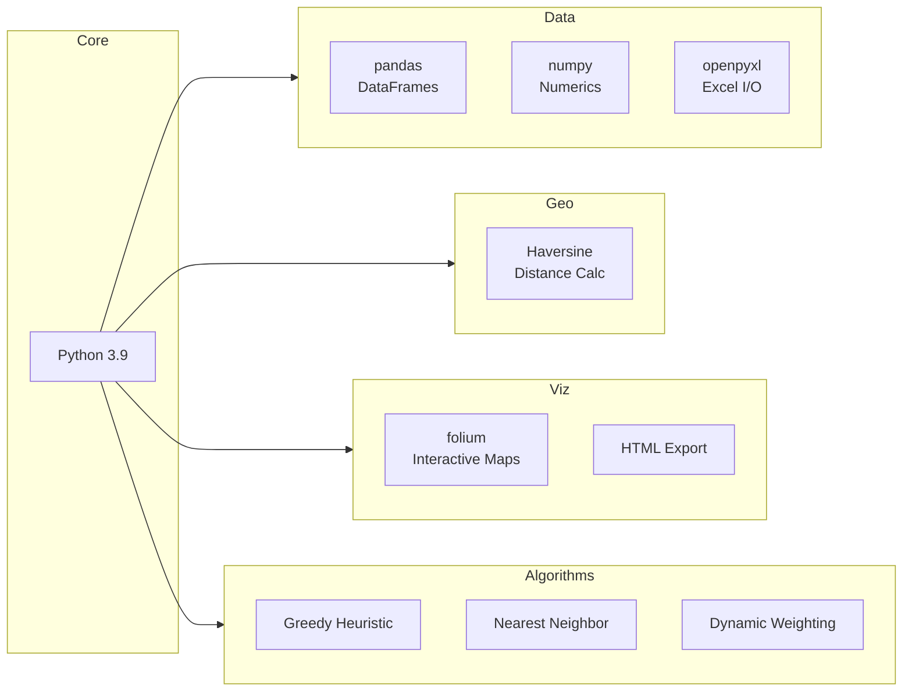

# Solution Concept Diagram

## Architecture Overview



## Component Details

### 1️⃣ Data Loading Layer
- **DataLoader**: Centralized Excel file reading
- **Validation**: Data type checking and normalization
- **Preprocessing**: Date parsing, coordinate extraction

### 2️⃣ Analysis Components
- **SkillExtractor**: NLP-based keyword extraction from job descriptions
- **DistanceCalculator**: Pre-computes 39,006 pairwise distances using haversine formula
- **AvailabilityManager**: Tracks calendar blocks and prevents conflicts
- **DynamicWeightManager**: Adjusts scoring weights based on job context

### 3️⃣ Three-Phase Optimization
```
Phase 0: TERRITORIAL DISTRIBUTION
├── Maximize spatial separation between technicians
└── Assign first job to each tech for day-level load balancing

Phase 1: GREEDY ASSIGNMENT
├── For each unassigned job:
│   ├── Score all available technicians
│   ├── Consider: skills × availability × travel
│   └── Assign to highest scorer
└── Use nearest-neighbor for route sequencing

Phase 2: OVERFLOW REASSIGNMENT
├── Handle jobs that couldn't fit in Phase 1
├── Try same day with all techs
├── Try any day in week
└── Force-fit with constraint relaxation (flexible mode)
```

### 4️⃣ Scoring Algorithm
```python
composite_score = (
    skill_weight × skill_match_score +
    availability_weight × time_slot_score +
    travel_weight × distance_efficiency_score
)
```

Dynamic weights adapt based on:
- **Job type**: Installation, repair, upgrade, troubleshoot
- **Customer tier**: Standard, premium, business
- **Time sensitivity**: Low, medium, high urgency

### 5️⃣ Output Generation
- **CSV Schedule**: 191 optimized assignments with rationale
- **Interactive Maps**: Folium-based visualization with tech/day filtering
- **Individual Schedules**: Per-technician Excel workbook with calendar integration
- **Quality Reports**: Comprehensive metrics and comparison analysis

## Data Flow Sequence



## Technology Stack



## Key Metrics & Results

| Metric | Before | After | Improvement |
|--------|--------|-------|-------------|
| **Skill Match** | 36.6% | 67.0% | **+82.9%** ✓ |
| **Schedule Preference** | 54.1% | 68.8% | **+27.2%** ✓ |
| **Travel Efficiency** | 75.7% | 79.7% | **+5.2%** ✓ |
| **Total Distance** | 2,927 km | 2,753 km | **-173 km** ✓ |
| **Overall Quality** | 54.3% | 71.5% | **+31.5%** ✓ |
| **Reassignment Rate** | - | 89.5% | 171/191 jobs |

## Constraints & Assumptions

### Hard Constraints ⛔
- Shift hours: 08:00-18:00 only
- No overlapping assignments
- Respect all job durations
- Only schedule in AVAILABLE blocks
- Max jobs per day limits (flexible +1 in overflow mode)

### Soft Constraints ⚠️
- Customer time preferences (bonused in scoring)
- Minimize travel distance
- Prefer skilled technicians
- Balance workload across team

### Assumptions 📋
- Straight-line distance (haversine) approximates road distance
- Job durations are accurate
- No traffic or weather delays
- Technicians start from home base
- No multi-technician jobs
- Calendar events are immutable

---

**Generated by**: Smart Technician Dispatch Optimizer  
**TELUS CAIO B2B Hackathon #1** | December 29-31, 2025
